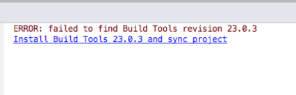
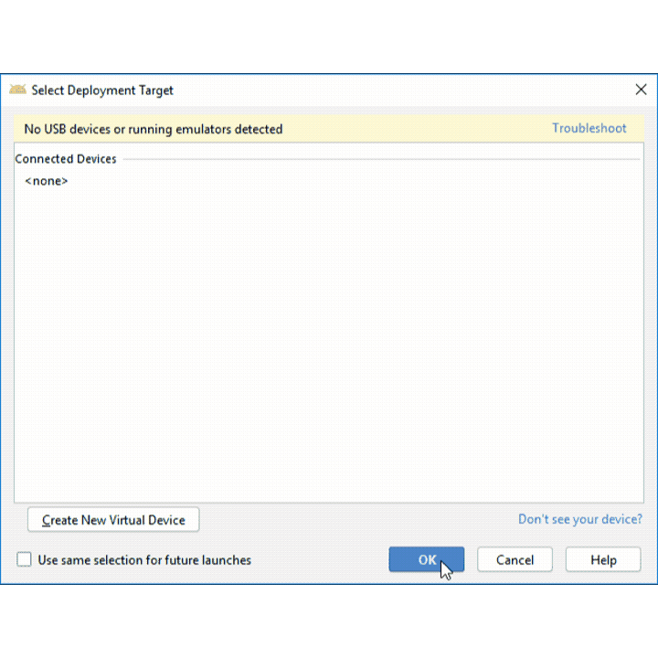

# Mobile Code-a-thon - Android Beginners

## Pre-requisites
### Clone Git Repository
1. Navigate to your working directory from command line or terminal
2. Enter this command: `git clone https://github.com/chrispconnolly/weatherappfinal.git`

### Install Android Studio
1. Navigate to this link: https://developer.android.com/studio
2. Install on the OS of your choice (Windows, Mac, Linux)

### Open the project in Android Studio and 'sync'
1. Open Android Studio
2. Open Existing Project
3. Do not download the latest version of Android Gradle Plugin
4. Navigate to the folder where you cloned the repo
5. Run a Gradle Sync to pull down all dependencies

### Download Required SDKs or other required tools
1. Open Android Studio
2. Open SDK Manager
3. Select these SDKs and tools (TBD)
4. Click OK

### Create an emulator (if necessary)
1. Open Android Studio
2. Open Android Virtual Device (AVD) Manager
3. Create Virtual Device
4. Any form factor is fine (recommend Pixel)
5. Any OS after Lollipop is fine but must be greater than Lollipop
6. You must download the system image for this OS version.
7. Next > Finish

